

  <!-- ENGINEERING TITLE BANNER -->
  <a href="https://github.com/Kausiq000">
    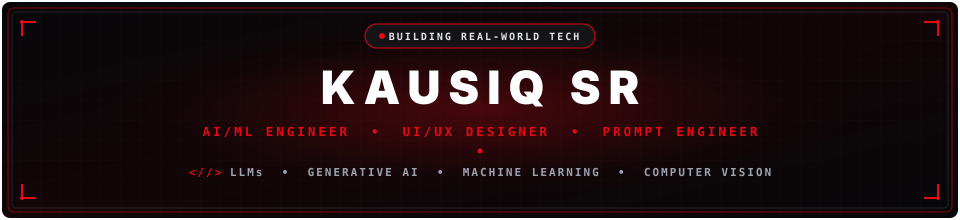
  </a>

    

  <!-- GREETING & IDENTITY -->
  <h3>Hi there! I'm Kausiq SR 👋</h3>

  

    <strong><code>AI/ML ENGINEER &nbsp;•&nbsp; UI/UX DESIGNER &nbsp;•&nbsp; PROMPT ENGINEER</code></strong>
  

  

    Final-Year B.Tech Student in Artificial Intelligence &amp; Machine Learning 
    <strong>SRM Institute of Science and Technology – Ramapuram</strong> • India
  

  <!-- CLEAN SINGLE-LINE DYNAMIC TYPING BANNER -->
  

    

  <!-- REFERENCE-STYLE COMPACT SOCIAL BADGES -->
  

    
    &nbsp;
    
    &nbsp;
    
    &nbsp;
    
    &nbsp;
    
  

  <!-- PROFILE VIEWS COUNTER -->
  

    
  

 

 

## 🔴 &nbsp; About Me

<table width="100%">
  <tr>
    <td width="54%" valign="top">
      <code><b>// PROFILE SUMMARY</b> &nbsp;|&nbsp; AIML STUDENT</code>
        
      <strong>Final-Year B.Tech Student in Artificial Intelligence and Machine Learning</strong> 
      SRM Institute of Science and Technology – Ramapuram • India
        
      I’m a final-year B.Tech student specializing in <strong>Artificial Intelligence and Machine Learning</strong> at SRM IST Ramapuram. My focus is on developing practical, edge-compatible AI solutions across <strong>Large Language Models (LLMs)</strong>, <strong>Generative AI</strong>, <strong>Natural Language Processing (NLP)</strong>, and <strong>Computer Vision</strong>.
        
      I combine machine learning model architectures with human-centered product development—leveraging structured <strong>prompt engineering</strong> alongside high-fidelity UI/UX design in <strong>Figma</strong> to build intelligent, user-centered digital applications.
        
      <code>LOCATION // SRM IST • RAMAPURAM • INDIA</code> 
      <code>STATUS // AVAILABLE FOR COLLABORATIVE OPPORTUNITIES</code>
    </td>
    <td width="46%" valign="middle" align="center">
      <!-- MULTI-STAGE AI ARCHITECTURE VISUAL -->
      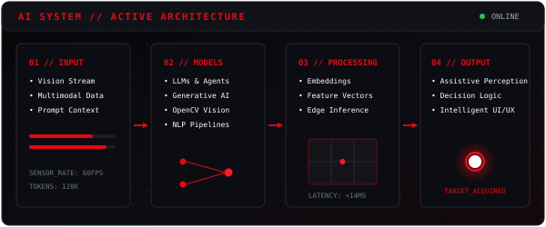
    </td>
  </tr>
</table>

 

 

## 🛠️ &nbsp; Engineering Tech Stack

<table width="100%">
  <tr>
    <td width="50%" valign="top">
      <code><b>01 //</b> <strong>PROGRAMMING LANGUAGES</strong></code>
        
      
        
      <code>Python • Java • C • C++</code>
    </td>
    <td width="50%" valign="top">
      <code><b>02 //</b> <strong>AI / ML &amp; DATA SYSTEMS</strong></code>
        
      
      
      
        
      <code>Scikit-learn • NLP Algorithms • Predictive Modeling</code>
    </td>
  </tr>
  <tr>
    <td width="50%" valign="top">
      <code><b>03 //</b> <strong>LLMs &amp; GENERATIVE AI</strong></code>
        
      
      
      
        
      <code>Context Grounding • Structured Prompting • Agent Workflows</code>
    </td>
    <td width="50%" valign="top">
      <code><b>04 //</b> <strong>COMPUTER VISION</strong></code>
        
       &nbsp;
      
        
      <code>OpenCV • Google MediaPipe • Edge Perception</code>
    </td>
  </tr>
  <tr>
    <td width="50%" valign="top">
      <code><b>05 //</b> <strong>UI / UX DESIGN</strong></code>
        
       &nbsp;
      
        
      <code>Figma • Interactive Prototyping • Design Systems</code>
    </td>
    <td width="50%" valign="top">
      <code><b>06 //</b> <strong>WEB &amp; BACKEND</strong></code>
        
      
        
      <code>FastAPI • Flask • HTML5 • CSS3</code>
    </td>
  </tr>
  <tr>
    <td colspan="2" valign="top">
      <code><b>07 //</b> <strong>DEVELOPMENT TOOLS &amp; ENVIRONMENT</strong></code>
        
      
        
      <code>Git Version Control • GitHub • VS Code • Postman API Testing</code>
    </td>
  </tr>
</table>

 

 

## 🌟 &nbsp; Featured Project Spotlight

<table width="100%">
  <tr>
    <td width="100%" valign="top">
      <!-- THEMATIC FLAGSHIP SVG HEADER -->
      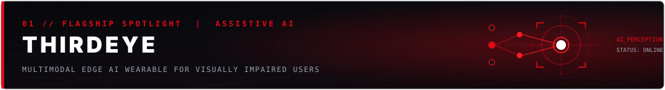
        
      

        <strong>Assistive technology designed to support visually impaired users.</strong>
      

      

        ThirdEye delivers real-time environmental perception and obstacle detection for visually impaired individuals through an offline edge-AI architecture, multimodal sensor telemetry, and localized tactile feedback.
      

      

        
        &nbsp;
        
        
        
        
      

    </td>
  </tr>
</table>

 

## 📂 &nbsp; Project Showcase

<table width="100%">
  <!-- ROW 1: 02 & 03 -->
  <tr>
    <td width="50%" valign="top">
      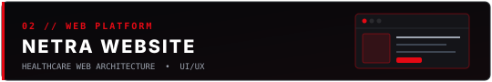
        
      
Healthcare assistant website development project focusing on responsive web architecture and user experience.

      
      
    </td>
    <td width="50%" valign="top">
      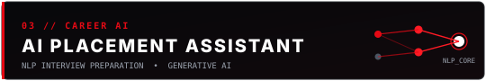
        
      
AI-powered placement preparation and interview assessment assistant leveraging NLP pipelines and structured evaluation.

      
      
      
    </td>
  </tr>
  <!-- ROW 2: 04 & 05 -->
  <tr>
    <td width="50%" valign="top">
      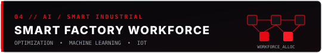
        
      
AI-based workforce allocation and management platform designed for scheduling and task optimization in smart factory environments.

      
      
      
    </td>
    <td width="50%" valign="top">
      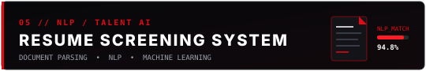
        
      
Resume screening and ranking system utilizing NLP text extraction, tokenization, and machine learning classification models.

      
      
      
    </td>
  </tr>
  <!-- ROW 3: 06 & 07 -->
  <tr>
    <td width="50%" valign="top">
      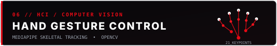
        
      
Hand gesture control and interactive recognition system using OpenCV vision pipelines and Google MediaPipe skeletal tracking.

      
      
      
    </td>
    <td width="50%" valign="top">
      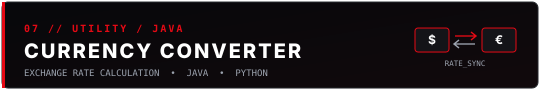
        
      
Currency conversion and exchange calculation utility developed with Java computational logic and Python data processing.

      
      
    </td>
  </tr>
  <!-- ROW 4: 08 & 09 -->
  <tr>
    <td width="50%" valign="top">
      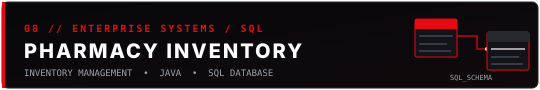
        
      
Enterprise pharmacy inventory management application backed by Java application logic and relational SQL database storage.

      
      
    </td>
    <td width="50%" valign="top">
      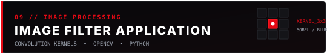
        
      
Digital image processing application executing spatial filtering, blur, sharpening, and edge detection kernels using OpenCV.

      
      
      
    </td>
  </tr>
  <!-- ROW 5: 10 -->
  <tr>
    <td colspan="2" valign="top">
      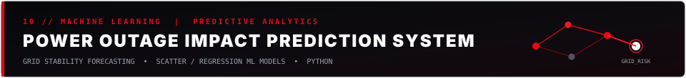
        
      
Machine learning project predicting regional electrical grid instability and outage impact factors using predictive statistical models.

      
      
      
    </td>
  </tr>
</table>

 

 

## 🏆 &nbsp; Milestones, Research &amp; Intellectual Property

<table width="100%">
  <tr>
    <td width="33%" align="center" valign="top">
      
        
      <strong><code>NXTGEN HACKATHON</code></strong> 
      Runner-up
    </td>
    <td width="34%" align="center" valign="top">
      
        
      <strong><code>THIRDEYE</code></strong> 
      Patent filed / under review
    </td>
    <td width="33%" align="center" valign="top">
      
        
      <strong><code>RESEARCH PUBLICATION</code></strong> 
      <em>"A Fully Offline, Multimodal Edge AI Wearable for the Visually Impaired"</em> 
      <strong>FMDB Transactions on Sustainable Biomedical Engineering</strong> 
      <a href="https://doi.org/10.69888/FTSBE.2026.000671">DOI: 10.69888/FTSBE.2026.000671</a>
    </td>
  </tr>
</table>

 

 

## 📊 &nbsp; GitHub Analytics &amp; Telemetry

  <table border="0" cellspacing="0" cellpadding="0">
    <tr align="center">
      <td>
        
      </td>
      <td>
        
      </td>
    </tr>
  </table>

   

  

 

 

## 🔭 &nbsp; Currently Exploring

<table width="100%">
  <tr>
    <td width="50%" valign="top">
      <code><b>01 //</b> <strong>LLMs &amp; AUTONOMOUS AGENTS</strong></code>
      
Exploring prompting architectures, context grounding, autonomous agent workflows, and practical LLM applications.

    </td>
    <td width="50%" valign="top">
      <code><b>02 //</b> <strong>GENERATIVE AI &amp; MULTIMODAL SYSTEMS</strong></code>
      
Experimenting with text, vision, and multimodal AI pipelines to solve real-world domain challenges.

    </td>
  </tr>
  <tr>
    <td width="50%" valign="top">
      <code><b>03 //</b> <strong>COMPUTER VISION &amp; ASSISTIVE AI</strong></code>
      
Investigating real-time computer vision perception models and edge-compatible assistive technologies.

    </td>
    <td width="50%" valign="top">
      <code><b>04 //</b> <strong>UI/UX &amp; PRODUCT DEVELOPMENT</strong></code>
      
Designing user-focused interfaces in Figma and bridging frontend interaction design with technical AI architectures.

    </td>
  </tr>
</table>

 

 

## 🤝 &nbsp; Let's Connect

<table width="100%">
  <tr>
    <td align="center" valign="middle">
      

        <em>Open to AI/ML projects, software development opportunities, and collaborative technical work.</em>
      

       
      

        
        &nbsp;
        
        &nbsp;
        
        &nbsp;
        
        &nbsp;
        
      

    </td>
  </tr>
</table>

 

<!-- TECHNICAL FOOTER SVG -->

  © 2026 KAUSIQ SR • AI/ML ENGINEER • UI/UX DESIGNER • PROMPT ENGINEER 
  SRM INSTITUTE OF SCIENCE AND TECHNOLOGY – RAMAPURAM

