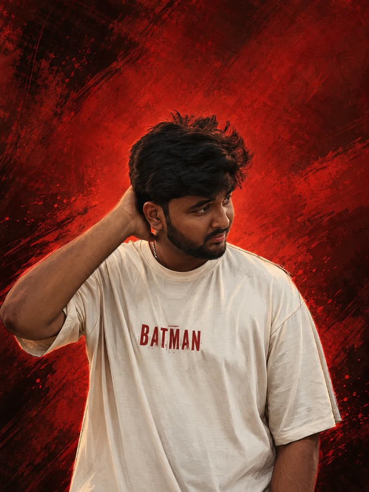

<div align="center">

  <!-- CINEMATIC HEADER BANNER -->
  

  <br/><br/>

  <!-- DYNAMIC TYPING SEQUENCE -->
  <a href="https://github.com/Kausiq000">
    
  </a>

  <br/><br/>

  <!-- QUICK PRODUCTION METADATA BADGES -->
  <a href="https://www.linkedin.com/in/kausiq-sr-5015942a2"></a>
  <a href="mailto:kausiqsr@gmail.com"></a>
  <a href="https://drive.google.com/drive/folders/1NodTsQREZlZgzx7k0xsnhAiiNDsav0Wc"></a>
  <a href="https://www.instagram.com/_.kxusiq._?stkn=d3IzdmE2cnBicXp4"></a>

  <br/><br/>

  <!-- PROFILE INTRODUCTION -->
  

</div>

<br/>


## 🎬 &nbsp; SCENE 01 &nbsp;::&nbsp; THE STORY

> *"Transforming raw algorithmic intelligence into practical, robust, and beautifully designed digital realities."*

I am a **final-year Artificial Intelligence and Machine Learning student** at **SRM Institute of Science and Technology – Ramapuram**, passionate about building intelligent and practical technology.

My interests span **Artificial Intelligence**, **Machine Learning**, **Large Language Models**, **Generative AI**, **Prompt Engineering**, and **UI/UX Design**. I enjoy transforming ideas into functional and robust projects while continuously exploring new AI technologies and creative ways to build better digital experiences.

I am particularly interested in combining **AI engineering** with **strong product thinking**, **visual design**, and **problem solving**.

<br/>

```ini
[ PRODUCTION LOGS ]
INSTITUTION     = SRM Institute of Science and Technology – Ramapuram
DEGREE          = B.Tech in Artificial Intelligence and Machine Learning (AIML)
ACADEMIC STATUS = Final-Year Student
LOCATION        = India
PRIMARY FOCUS   = AI/ML Engineering • UI/UX Design • Prompt Engineering • LLMs
```

<br/>


## 🛠️ &nbsp; SCENE 02 &nbsp;::&nbsp; THE CRAFT

Organized by production disciplines across the AI and engineering spectrum:

### 🧠 AI & Machine Learning
<p>
  
  
  
  
  
  
  
</p>

### 🎨 UI/UX & Design
<p>
  
  
</p>

### 💻 Programming Languages
<p>
  
  
  
  
</p>

### ⚙️ Development & Backend
<p>
  
  
  
  
  
</p>

### 🧰 Tools & Technologies
<p>
  
  
  
  
  
  
  
</p>

<br/>


## 🎥 &nbsp; SCENE 03 &nbsp;::&nbsp; FEATURED PROJECTS

Presented as cinematic title cards showcasing engineered solutions, intelligent systems, and interactive architectures:

<table width="100%">
  <tr>
    <td width="50%" valign="top">
      <h3><code>01 // THIRDEYE</code></h3>
      <p><strong>Assistive technology designed to support visually impaired users.</strong></p>
      <p>
        <br/>
        
      </p>
    </td>
    <td width="50%" valign="top">
      <h3><code>02 // NETRA WEBSITE</code></h3>
      <p><strong>Website development project.</strong></p>
      <p>
        
      </p>
    </td>
  </tr>
  <tr>
    <td width="50%" valign="top">
      <h3><code>03 // AI PLACEMENT ASSISTANT</code></h3>
      <p><strong>AI-powered placement preparation assistant engineered to streamline candidate readiness and skill assessment.</strong></p>
      <p>
        
      </p>
    </td>
    <td width="50%" valign="top">
      <h3><code>04 // SMART FACTORY WORKFORCE AI</code></h3>
      <p><strong>AI-driven workforce allocation and operational management system designed for intelligent, automated manufacturing environments.</strong></p>
      <p>
        
      </p>
    </td>
  </tr>
  <tr>
    <td width="50%" valign="top">
      <h3><code>05 // RESUME SCREENING SYSTEM</code></h3>
      <p><strong>Automated resume parsing and candidate evaluation pipeline utilizing natural language processing and machine learning models.</strong></p>
      <p>
        
      </p>
    </td>
    <td width="50%" valign="top">
      <h3><code>06 // HAND GESTURE CONTROL</code></h3>
      <p><strong>Real-time touchless human-computer interaction interface tracking hand landmarks and gesture commands via computer vision.</strong></p>
      <p>
        
      </p>
    </td>
  </tr>
  <tr>
    <td width="50%" valign="top">
      <h3><code>07 // CURRENCY CONVERTER</code></h3>
      <p><strong>Currency conversion project involving Java and Python.</strong></p>
      <p>
        
      </p>
    </td>
    <td width="50%" valign="top">
      <h3><code>08 // PHARMACY INVENTORY SYSTEM</code></h3>
      <p><strong>Java + SQL based pharmacy inventory management system.</strong></p>
      <p>
        
      </p>
    </td>
  </tr>
  <tr>
    <td width="50%" valign="top">
      <h3><code>09 // IMAGE FILTER APPLICATION</code></h3>
      <p><strong>Interactive digital image processing application performing custom spatial filtering, transformations, and visual kernels.</strong></p>
      <p>
        
      </p>
    </td>
    <td width="50%" valign="top">
      <h3><code>10 // POWER OUTAGE IMPACT PREDICTION</code></h3>
      <p><strong>Machine learning project for predicting the impact of power outages.</strong></p>
      <p>
        
      </p>
    </td>
  </tr>
</table>

<br/>


## 🏆 &nbsp; SCENE 04 &nbsp;::&nbsp; THE MILESTONES

Milestones, research and intellectual property:

<table width="100%">
  <tr>
    <td width="33%" align="center" valign="top">
      <br/>
      <br/><br/>
      <strong>NXTGEN Hackathon</strong><br/>
      <sub>Recognized for innovative engineering and practical technological execution.</sub>
      <br/><br/>
    </td>
    <td width="34%" align="center" valign="top">
      <br/>
      <br/><br/>
      <strong>ThirdEye Assistive Technology</strong><br/>
      <sub>Intellectual property filed for assistive vision systems supporting visually impaired users.</sub>
      <br/><br/>
    </td>
    <td width="33%" align="center" valign="top">
      <br/>
      <br/><br/>
      <strong>Research Publication</strong><br/>
      <em>"A Fully Offline, Multimodal Edge AI Wearable for the Visually Impaired"</em><br/>
      <sub>FMDB Transactions on Sustainable Biomedical Engineering, 2026<br/>
      DOI: 10.69888/FTSBE.2026.000671</sub>
      <br/><br/>
    </td>
  </tr>
</table>

<br/>


## 📊 &nbsp; SCENE 05 &nbsp;::&nbsp; THE DASHBOARD

GitHub activity and contribution analytics:

<div align="center">
  <table border="0" cellspacing="0" cellpadding="0">
    <tr align="center">
      <td>
        
      </td>
      <td>
        
      </td>
    </tr>
  </table>

  <br/>

  
</div>

<br/>


## 🔭 &nbsp; SCENE 06 &nbsp;::&nbsp; CURRENTLY EXPLORING

Current learning and exploration areas:

- 🔬 **Large Language Models & Autonomous Agents** — Studying advanced prompting architectures, context grounding, and multi-step reasoning systems.
- ⚡ **Generative AI & Multimodal Synthesis** — Experimenting with text, vision, and real-time inference models to solve practical domain challenges.
- 👁️ **Computer Vision & Assistive Edge AI** — Expanding real-time perception pipelines for accessibility technologies.
- 🎨 **Figma to Production Synergy** — Designing clean, high-fidelity UI/UX systems that intuitively bridge complex AI functionality with end users.

<br/>


## 🎞️ &nbsp; SCENE 07 &nbsp;::&nbsp; END CREDITS

<div align="center">

  

  <br/><br/>

  <!-- OFFICIAL CONNECT CHANNELS -->
  <a href="https://www.linkedin.com/in/kausiq-sr-5015942a2" target="_blank">
    
  </a>
  &nbsp;
  <a href="https://drive.google.com/drive/folders/1NodTsQREZlZgzx7k0xsnhAiiNDsav0Wc" target="_blank">
    
  </a>
  &nbsp;
  <a href="mailto:kausiqsr@gmail.com">
    
  </a>
  &nbsp;
  <a href="https://www.instagram.com/_.kxusiq._?stkn=d3IzdmE2cnBicXp4" target="_blank">
    
  </a>

  <br/><br/>

  <sub>© 2026 KAUSIQ SR &nbsp;•&nbsp; AI/ML ENGINEER &nbsp;•&nbsp; BUILDING INTELLIGENT SYSTEMS</sub>

</div>
